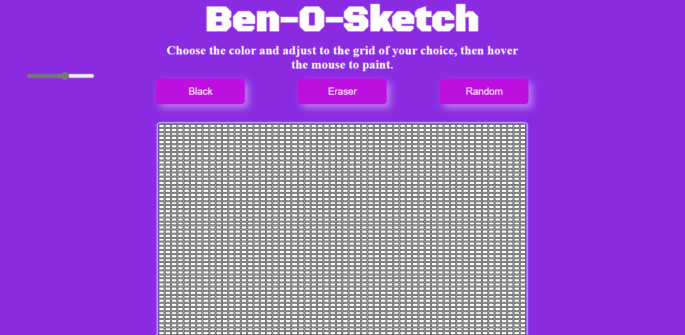

# Ben-O-Sketch

This is a simple web app that lets you draw using your mouse on an Etch-A-Sketch board. You can shake the board to erase the drawing and start over.

## Demo

Check out a live demo of the app [here](https://benosketch.netlify.app/)

## How to use
1. Open the index.html file in your browser.
2. Use the range input at the top-left of the page to adjust the size of the grid to your liking.
3. Click on a color button to choose your desired drawing color.
4. Move your mouse over the board to draw.

Have fun drawing!

## Technologies used

HTML, CSS & JavaScript

## Credit
The app was created by [Benedicta](https://github.com/BenedictaUche)

